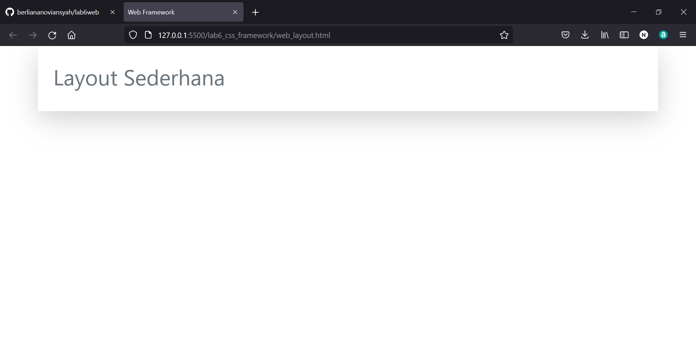
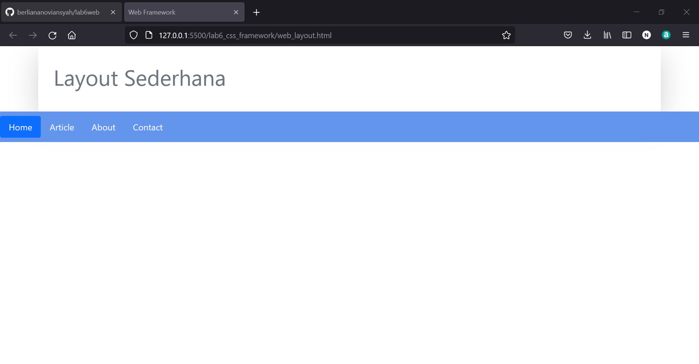
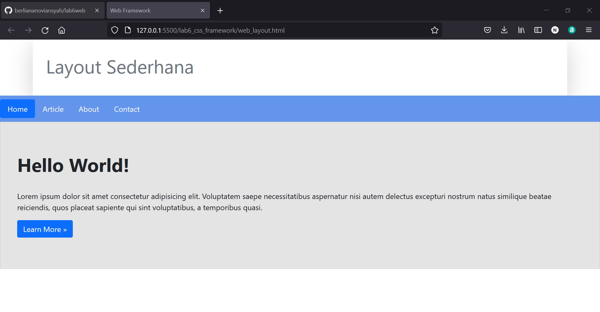
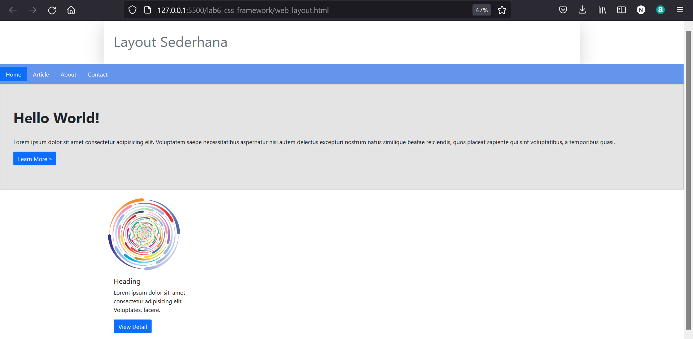
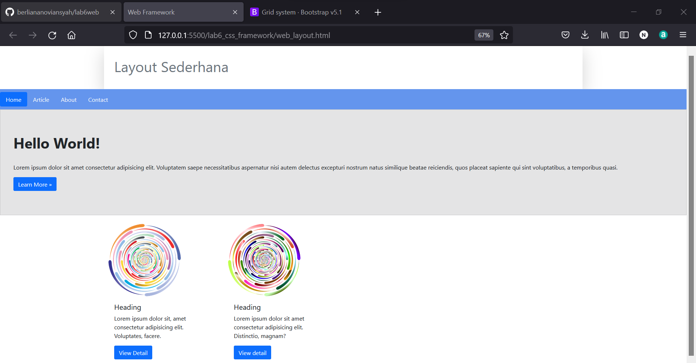
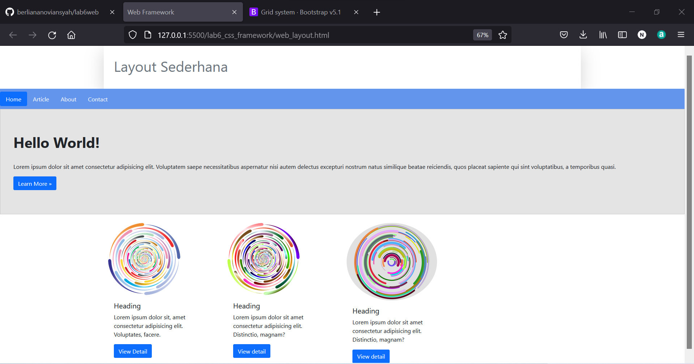

|  Berliana Noviansyah  |     312010373     |
|-----------------------|-------------------|
|       TI.20.A1        |  Pemrograman Web  |

# Praktikum 6 Pertemuan 7


# WEB FRAMEWORK BOOTSTRAP


## 1). Membuat Struktur Dasar Dokumen HTML

Framework Bootstrap pada dasar HTML digunakan untuk dapat tetap terhubung dengan dokumen HTML yang memerlukan link yang sudah disediakan boostrap dengan link CDN atau melalui online link seperti contoh salinan code dibawah.

**Dengan coding adalah sebagai berikut:**

```html
<!doctype html>
<html lang="en">
  <head>
    <!-- Required meta tags -->
    <meta charset="utf-8">
    <meta name="viewport" content="width=device-width, initial-scale=1">

    <!-- Bootstrap CSS -->
    <link href="https://cdn.jsdelivr.net/npm/bootstrap@5.1.3/dist/css/bootstrap.min.css" rel="stylesheet" integrity="sha384-1BmE4kWBq78iYhFldvKuhfTAU6auU8tT94WrHftjDbrCEXSU1oBoqyl2QvZ6jIW3" crossorigin="anonymous">

    <title>Web Framework</title>
  </head>
  <body>


    <!-- Optional JavaScript; choose one of the two! -->

    <!-- Option 1: Bootstrap Bundle with Popper -->
    <script src="https://cdn.jsdelivr.net/npm/bootstrap@5.1.3/dist/js/bootstrap.bundle.min.js" integrity="sha384-ka7Sk0Gln4gmtz2MlQnikT1wXgYsOg+OMhuP+IlRH9sENBO0LRn5q+8nbTov4+1p" crossorigin="anonymous"></script>

    <!-- Option 2: Separate Popper and Bootstrap JS -->
    <!--
    <script src="https://cdn.jsdelivr.net/npm/@popperjs/core@2.10.2/dist/umd/popper.min.js" integrity="sha384-7+zCNj/IqJ95wo16oMtfsKbZ9ccEh31eOz1HGyDuCQ6wgnyJNSYdrPa03rtR1zdB" crossorigin="anonymous"></script>
    <script src="https://cdn.jsdelivr.net/npm/bootstrap@5.1.3/dist/js/bootstrap.min.js" integrity="sha384-QJHtvGhmr9XOIpI6YVutG+2QOK9T+ZnN4kzFN1RtK3zEFEIsxhlmWl5/YESvpZ13" crossorigin="anonymous"></script>
    -->
  </body>
</html>
```


## 2). membuat Container

**Contoh Codingnya:**

```html
 <!-- Container -->
 <div class="container">

</div>
```


## 3). Membuat Card Header


**Codingnya:**

```html
<!-- Container -->
<div class="container shadow-lg">
    <div class="card-body">
        <h1 class="text-muted py-3">Layout Sederhana</h1>
    </div>
</div>
```


**Outputnya:**




## 4). Membuat Navigasi


**Codingnya:**

```html
<nav class="navbar" style="background-color: cornflowerblue;">
    <ul class="nav nav-pills">
        <li class="nav-item">
            <a class="nav-link active text-light" aria-current="page" href="#">Home</a>
        </li>
        <li class="nav-item">
            <a class="nav-link text-light" href="#">Article</a>
        </li>
        <li class="nav-item">
            <a class="nav-link text-light" href="#">About</a>
        </li>
        <li class="nav-item">
            <a class="nav-link text-light" href="#">Contact</a>
        </li>
    </ul>
</nav>
```


**Outputnya:**




## 5). Membuat Card Section Description


**Codingnya:**

```html
div class="card" style="width: 80,1rem; padding: 50px 20px; background-color: #e4e4e5; border-radius: 0;">
    <div class="card-body">
        <h1 class="card-title pb-4" style="font-weight: bold;">Hello World!</h1>
        <p class="card-text">Lorem ipsum dolor sit amet consectetur adipisicing elit. Voluptatem saepe
            necessitatibus aspernatur nisi autem delectus excepturi nostrum natus similique beatae
            reiciendis, quos placeat sapiente qui sint voluptatibus, a temporibus quasi.</p>
        <a href="#" class="btn btn-primary">Learn More »</a>
    </div>
</div>
```

**Outputan:**




## 6). Membuat (Card 1, Card 2, Card 3) dan Widget dengan Grid Row dan Col


## Card 1


**Codingnya:**


```html
<!-- Row Content 1 -->
<div class="row">
    <!-- card 1 -->
    <div class="col-3">
        <div class="col mt-4">
            <div class="card" style="width: 18rem; border: 0;">
                
                <div class="card-body">
                    <h5 class="card-title">Heading</h5>
                    <p class="card-text">Lorem ipsum dolor sit, amet consectetur adipisicing elit. Voluptates,
                        facere.</p>
                    <a href="#" class="btn btn-primary">View Detail</a>
                </div>
            </div>
        </div>
    </div>
</div>
```


**Output:**





## Card 2


**Coding:**

```html
 <div class="col"><!-- card 2 -->
        <div class="col-3">
            <div class="col mt-4">
                <div class="card" style="width: 18rem; border: 0;">
                    
                    <div class="card-body">
                        <h5 class="card-title">Heading</h5>
                        <p class="card-text">Lorem ipsum dolor sit amet consectetur adipisicing elit. Distinctio,
                            magnam?</p>
                        <a href="#" class="btn btn-primary">View detail</a>
                    </div>
                </div>
            </div>
        </div></div>
```

**Outputnya:**




## Card 3


**Coding:**

```html
  <div class="col"><!-- card 3 -->
            <div class="col-3">
                <div class="col mt-4">
                    <div class="card" style="width: 18rem; border: 0;">
                        
                        <div class="card-body">
                            <h5 class="card-title">Heading</h5>
                            <p class="card-text">Lorem ipsum dolor sit amet consectetur adipisicing elit. Distinctio,
                                magnam?</p>
                            <a href="#" class="btn btn-primary">View detail</a>
                        </div>
                    </div>
                </div>
            </div></div>
```


**Output:**


